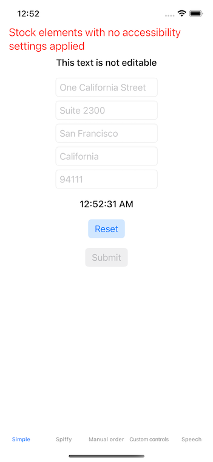

# AccessibilityFun

Demo/sandbox app for Voiceover. Most of the interesting stuff is in `Main.storyboard`.

How to use? Build and run, and then turn on Voiceover.

There are 5 scenes in the storyboard.

The first 3 are all notional examples of an address entry form. None of the fields or controls actually do anything, except that the `Reset`
button clears all fields and resets First Responder to nil.
Tab names: 
* Simple: what you'd get if you just drop text fields and labels onto the storyboard, without tweaking the accessibility settings.
* Spiffy: tweak some accessibility settings slightly. Low lift, big improvement. Note "hints", the digit by digit zipcode (if you enter text), and the "updates frequently" setting for the time-of-day field.
* Random: set an arbitrary "swipe order" for voiceover.

The fourth scene is an example of assigning Voiceover attributes/ARIA tags to plan old UIViews. Each teal square is just a `UIView`, with one or
more Accessibility attributes set (command-option-4 in the Storyboard editor). This is the sort of thing you'd do if you've written a custom view
that takes on the role of a Button, Search Bar, or some other control.

The fifth scene plays with two text-to-speech settings, namely `.accessibilitySpeechIPANotation` and `.accessibilitySpeechSpellOut`.
`.accessibilitySpeechIPANotation` is a way to apply custom International Phonetic Alphabet pronunciations to an attributed string, perhaps
to make "live" rhyme with either "five" or "give". The upper portion of that screen shows multiple pronunciations of my last name. The lower portion
shows some nautical terms that aren't pronounced the way they look. The view controller source code for this scene is worth a look. 
`.accessibilitySpeechSpellOut` is an attribute you'd add if you want a number (or word) 
spoken character by character: "nine eight one zero seven"
for a zipcode instead of "ninety-eight thousand one hundred seven". Many of the IPAs in this scene produce off-target or odd results.

In all cases, red text has its Accessible Element tag set to false. It will not be rendered by a Braille display nor spoken by a screenreader.

One more time: look at the storyboard, because that's where most of the interesting stuff sits.
